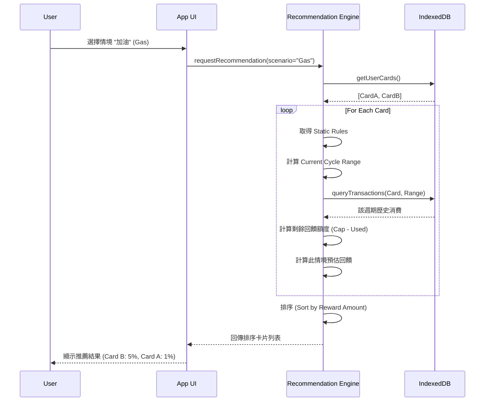
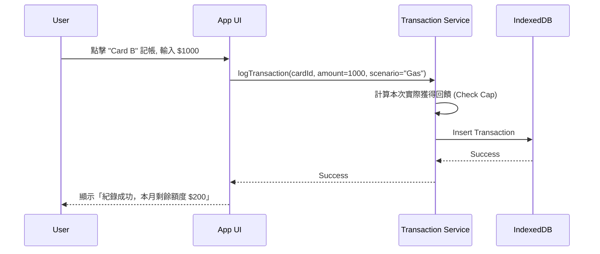

# Credit Card Optimizer PWA - Technical Specification

## 1. 系統架構 (System Architecture)

### 1.1 技術堆疊 (Tech Stack)
- **Frontend Framework**: Next.js (App Router) 或 Vite + React (以 Static Export 模式為主，確保可純靜態部署)
- **Language**: TypeScript
- **Styling**: Tailwind CSS (Mobile-first design)
- **Local Database**: Dexie.js (IndexedDB wrapper) - 用於儲存使用者設定與交易紀錄
- **PWA Capabilities**: `next-pwa` 或 `vite-plugin-pwa`
  - `manifest.json`: 定義 App Icon, Name, Standalone mode
  - `service-worker`: 快取靜態資源，確保離線可用

### 1.2 資料流架構
此系統採用 **Local-First** 架構。
1. **Static Data**: 內建的信用卡回饋規則 (`Card Database`) 作為靜態 JSON 檔案打包在相關程式碼中。
2. **User Data**: 使用者的卡片設定、消費紀錄儲存在瀏覽器的 `IndexedDB`。
3. **Logic**: 所有運算（回饋計算、排序）皆在 Client 端執行。

## 2. 資料結構 (Data Structures)

### 2.1 信用卡定義資料 (Static JSON - Card Definitions)
存放於 `src/data/cards.json`
```typescript
interface RewardRule {
  category: string; // e.g., "general", "convenience_store", "gas", "online"
  percentage: number; // e.g., 3.0 for 3%
  capType: "none" | "amount" | "points"; // 無上限、回饋金額上限、點數上限
  capValue?: number; // 上限數值 (例如每月 500 元)
  period: "monthly" | "statement_cycle"; // 日曆月 或 帳單週期
}

interface CardDefinition {
  id: string;
  name: string; // e.g., "富邦 J 卡"
  bank: string;
  imageUrl: string;
  defaultBillingCycleDay: number; // 預設結帳日
  rules: RewardRule[];
}
```

### 2.2 使用者設定 (Local DB - User Settings)
Store: `user_cards`
```typescript
interface UserCard {
  id: string; // UUID
  cardDefId: string; // 關聯到 Static Card Definition
  billingCycleDay: number; // 使用者設定的結帳日 (1-31)
  isEnabled: boolean;
}
```

### 2.3 交易紀錄 (Local DB - Transactions)
Store: `transactions`
```typescript
interface Transaction {
  id: string; // UUID
  userCardId: string;
  timestamp: number; // Unix timestamp
  amount: number;
  scenario: string; // 消費當下的情境 tag
  earnedReward: number; // 當下計算出的回饋金
  note?: string;
}
```

## 3. 核心演算法邏輯 (Core Logic)

### 3.1 週期計算 (Cycle Calculation)
需根據 `billingCycleDay` 算出當前交易屬於哪個計算週期。
- 若 `period` 為 `monthly`: 週期為 `YYYY-MM` (e.g., 2023-10-01 ~ 2023-10-31)
- 若 `period` 為 `statement_cycle`: 需動態計算。
  - 例如結帳日為 5 號。則 10/4 的消費屬於 9/6 ~ 10/5 週期。

### 3.2 剩餘回饋額度計算 (Remaining Cap Calculation)
```typescript
function getRemainingCap(userCard: UserCard, rule: RewardRule): number {
  if (rule.capType === 'none') return Infinity;
  
  // 1. 找出目前週期的時間範圍 (Start Date ~ End Date)
  const { start, end } = getCycleRange(userCard.billingCycleDay, rule.period, new Date());
  
  // 2. 查詢該 UserCard 在此範圍內的所有 Transactions
  const history = await db.transactions
    .where('userCardId').equals(userCard.id)
    .and(tx => tx.timestamp >= start && tx.timestamp <= end)
    .toArray();

  // 3. 加總這條規則已產生的回饋 (若是共用額度需特別處理，V1 先假設規則間額度獨立或簡單加總)
  const usedCap = history.reduce((sum, tx) => sum + tx.earnedReward, 0);
  
  return rule.capValue - usedCap;
}
```

### 3.3 最佳卡片排序 (Recommendation Ranking)
當使用者選擇情境 `S`，輸入預估金額 `X` (若未輸入則假設 $1,000):
1. 遍歷所有 `UserCard`。
2. 對每張卡，找到對應情境 `S` 的最佳 `RewardRule` (若無特定規則則用 `general`)。
3. 計算預估回饋 `EstimatedReward = X * (rule.percentage / 100)`。
4. 檢查 `getRemainingCap`。
   - 若 `EstimatedReward > RemainingCap`，則實際回饋 = `RemainingCap` (若剩餘 > 0)。
   - 若 `RemainingCap <= 0`，實際回饋 = 0 (或僅剩基本回饋)。
5. 依照 `實際回饋金額` > `回饋率` 排序回傳列表。

## 4. API 介面定義 (Internal Service Layers)

由於是 Client-side App，這裡定義的是內部的 Service Function 簽章。

### 4.1 CardService
- `getAllSupportedCards(): CardDefinition[]`
- `getUserCards(): Promise<UserCard[]>`
- `addUserCard(cardDefId: string, billingDay: number): Promise<void>`

### 4.2 RecommendationService
- `recommendCards(scenario: string, amount: number): Promise<RecommendationResult[]>`
  - `RecommendationResult`: `{ userCard, effectiveRate, estimatedReward, warningMessage }`

### 4.3 TransactionService
- `logTransaction(transaction: Transaction): Promise<void>`
- `getCycleUsage(userCardId: string, cycleStart: Date, cycleEnd: Date): Promise<number>`

## 5. 循序圖 (Sequence Diagrams)

### 5.1 使用者查詢推薦卡片



### 5.2 記帳流程


